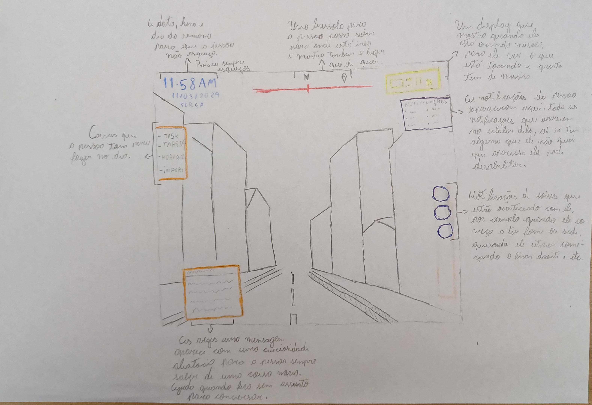

# trabalho_HUD_UX

## Identificação:
Gabriel Mutter de Souza
## Explicação:
A minha HUD serve para o usuario não ficar olhando o celular toda hora, principalmente na rua, para previnir furtos. Ela é é muito útil também quando você está em uma situação que não pode pegar o celular.
## Referência e Inspiração:
Minhas duas únicas inspirações foi para dois itens que tem na HUD, que é a bússola que tem na parte de cima, minha inspiração foi Skyrim e a outra são as bolinhas na lateral direita da tela, que minha inspirção foi Project Zomboid.
## Descrição da Experiência na Atividade Prática:

## Decisões e Justificativas:

## registros da atividade:

